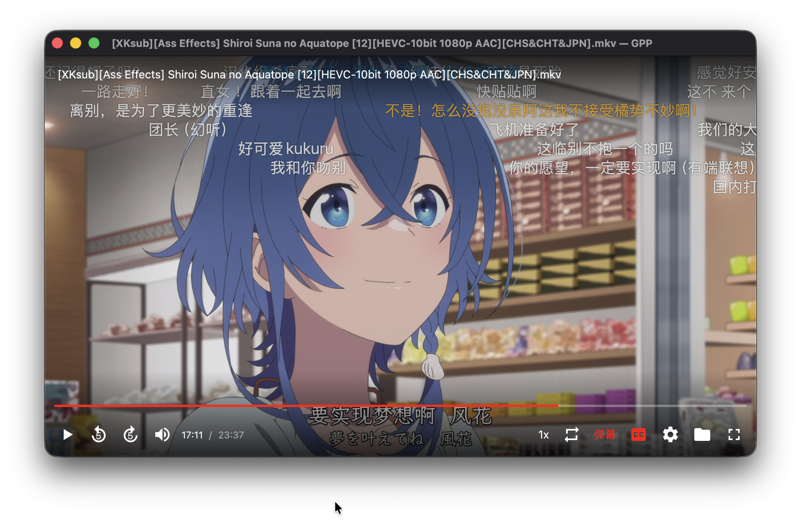

# GPP

[English](README.md) | [简体中文](README.zh-CN.md)

GPP 是一款使用 Rust 编写的 GPU 加速视频播放器。界面基于
[GPUI](https://www.gpui.rs/)，播放功能由
[GStreamer](https://gstreamer.freedesktop.org/)（通过 `gpui-video-player`）提供。

目前 GPP 的桌面发布版本主要面向 macOS。在安装了所需 GStreamer
开发包的情况下，Rust 应用本身也可以在 Linux 上编译。

> 本文件是项目文档的简体中文版本；应用界面目前仅提供英文。



## 功能

- 播放本地文件和 HTTP(S) 网络流
- 将文件或文件夹拖入窗口播放；拖入文件夹时会自动扫描其中的视频
- 类 YouTube 播放控制层：SVG 图标、红色进度条、悬停进度圆点和展开式音量滑块
- 播放/暂停、前后跳转 5 秒、音量、静音、循环和倍速播放
- 播放列表切换下一项
- 支持内嵌及外挂字幕（SRT / ASS / VTT），通过 GStreamer `assrender` 和 libass 渲染；可按 `C` 或点击 CC 按钮切换
- 支持哔哩哔哩 XML / JSON 弹幕；使用系统文字绘制以支持 Emoji，弹幕位于视频上方、GPUI 提示层下方，并避开字幕区域；可按 `D` 开关
- 全屏播放
- 播放时自动隐藏控制栏
- 全局设置面板，可配置自动播放、音量、倍速、字幕和弹幕默认值
- 关于页面，可查看版本、架构、许可证、更新入口和项目链接

## 安装

从仓库的 [Releases](https://github.com/giantpand2000/GPP/releases) 页面下载适合 Mac
架构的 zip 文件，解压后将 `GPP.app` 移入“应用程序”文件夹。

发布版使用 ad-hoc 签名，尚未经过 Apple 公证。首次启动时，macOS 可能要求右键点击
应用并选择“打开”。发布包已经内置独立的 GStreamer 运行时，普通用户不需要另行安装
GStreamer。

可在设置面板的“About”标签页查看当前版本、构建架构、许可证、项目地址、更新页面、
问题反馈和第三方组件声明，也可以通过 macOS 菜单 **GPP → About GPP** 直接打开。

## 从源码运行

### 环境要求

- Rust 1.85 或更高版本（edition 2024）
- **Xcode**。GPUI 需要编译 Metal 着色器，仅安装 Command Line Tools 不够。可运行：

  ```bash
  sudo xcode-select -s /Applications/Xcode.app/Contents/Developer
  ```

  如果 `xcrun metal --version` 提示缺少 Metal Toolchain，请运行：

  ```bash
  xcodebuild -downloadComponent MetalToolchain
  ```

- GStreamer 1.14 或更高版本，以及 base / good 插件；建议安装 bad / libav 以支持更多编码格式

### macOS

安装 [GStreamer 官方 macOS 运行时](https://gstreamer.freedesktop.org/download/#macos)，
使下面的路径存在：

```text
/Library/Frameworks/GStreamer.framework
```

项目提供了 pkg-config 桩文件，因此仅安装运行时 Framework 也可以完成链接。
也可以使用 Homebrew 安装：

```bash
brew install gstreamer gst-plugins-base gst-plugins-good gst-plugins-bad gst-libav
```

### Linux

```bash
# Debian / Ubuntu
sudo apt install \
  libgstreamer1.0-dev libgstreamer-plugins-base1.0-dev \
  gstreamer1.0-plugins-good gstreamer1.0-plugins-bad gstreamer1.0-libav

# Fedora
sudo dnf install gstreamer1-devel gstreamer1-plugins-base-devel \
  gstreamer1-plugins-good gstreamer1-plugins-bad-free
```

### 运行

```bash
cargo run --release
cargo run --release -- /path/to/movie.mp4
cargo run --release -- https://example.com/stream.m3u8
```

## macOS 打包

```bash
./scripts/package-macos.sh --zip
open dist/GPP.app

# 或安装应用，以便在 Finder 的“打开方式”中使用：
./scripts/package-macos.sh --install
```

该脚本会生成 `dist/GPP.app` 和带版本号的
`dist/GPP-<version>-macOS-<architecture>.zip`，将 `assets/app-icon.png` 编译为
`AppIcon.icns`，并注册 `src/util.rs` 中列出的 mp4、mkv、webm、mov 等视频扩展名。

打包器会将官方 GStreamer Framework 复制进应用，并将其中的 Mach-O 文件裁剪为当前
构建主机的架构。zip 旁边还会生成对应的 `.sha256` 校验文件。

构建机器需要安装官方 GStreamer Framework。如果 Framework 不在默认路径，可以设置：

```bash
GSTREAMER_FRAMEWORK=/path/to/GStreamer.framework ./scripts/package-macos.sh --zip
```

第三方组件声明及适用的 GNU 许可证文本会一并放入
`GPP.app/Contents/Resources`。

## 持续集成和发布

GitHub Actions 会检查代码格式，运行 Clippy 和测试，并分别为 Apple Silicon 与 Intel Mac
构建应用、验证应用可以独立运行，然后上传两种架构的 zip。推送与 Cargo 版本一致的标签
（例如 `v0.1.0`）时，还会自动将这些压缩包发布到 GitHub Releases。

完整发布步骤请参阅 [CONTRIBUTING.md](CONTRIBUTING.md)。

## 快捷键

| 按键 | 功能 |
| --- | --- |
| Space / K | 播放或暂停 |
| ← / J | 后退 5 秒 |
| → / L | 前进 5 秒 |
| Shift+← / Shift+→ | 后退或前进 15 秒 |
| ↑ / ↓ | 调整音量 |
| M | 静音 |
| R | 循环播放 |
| S | 切换播放速度 |
| C | 切换字幕 |
| D | 开关弹幕 |
| F | 全屏 |
| N / P | 下一项 / 上一项 |
| Home / 0 | 从头播放 |
| ⌘O / Ctrl+O | 打开文件 |
| 双击视频 | 全屏 |

## 项目结构

- `src/player.rs`：GPUI 视图、播放控制和播放列表
- `src/theme.rs`：颜色主题
- `gpui-video-player`：GStreamer `playbin` 与 GPUI 渲染的 NV12 视频帧；macOS 使用 `CVPixelBuffer`

## 许可证

GPP 应用采用 [Apache License 2.0](LICENSE-APACHE) 或 [MIT](LICENSE-MIT)
双许可证，使用者可以任选其一。仓库内的 `crates/gpui-video-player` crate 保留其原始 MIT
许可证。
